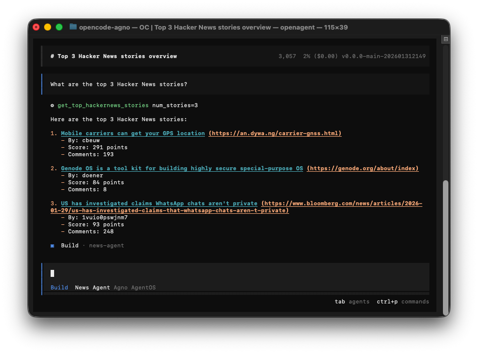
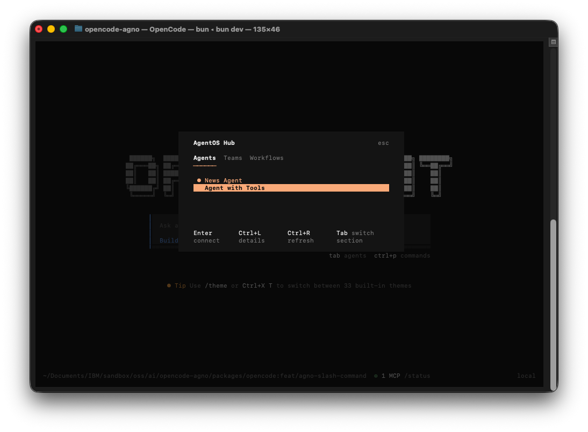
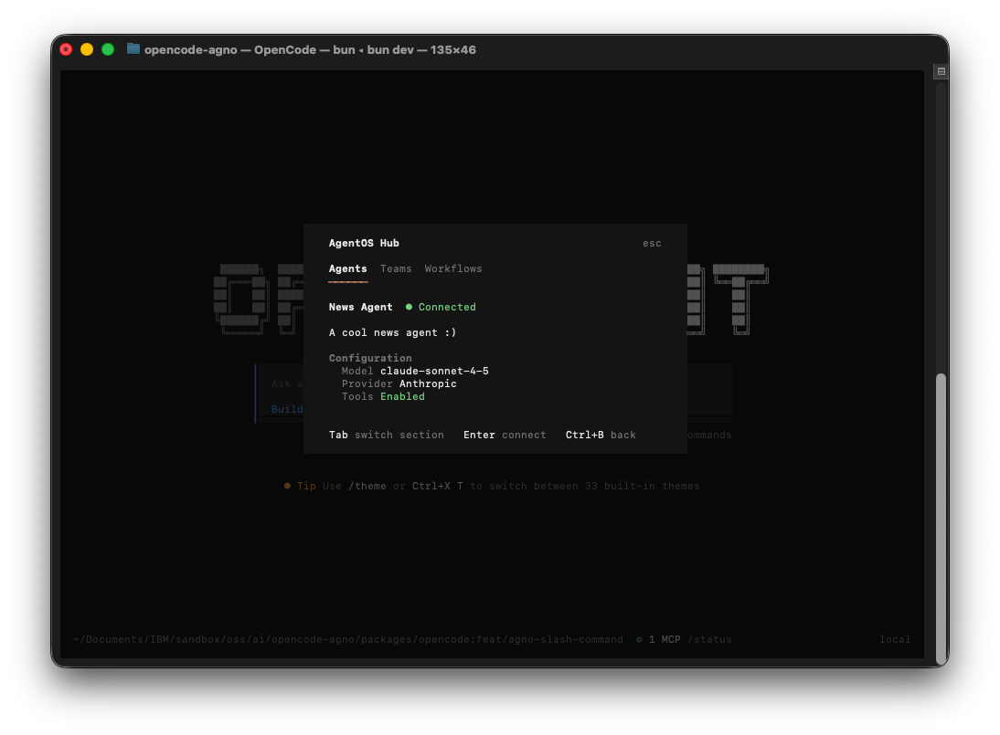

<h1 align="center">openagent</h1>
<p align="center">The open source <a href="https://github.com/agno-agi/agno">AgentOS</a> client.</p>
<p align="center">
  <a href="OPENAGENT.md"><strong>Get Started →</strong></a>
</p>

---



## Mission

**Connect to AgentOS agents from the terminal.**

Openagent is a terminal-first client for [AgentOS](https://docs.agno.com/agent-os/introduction). Whether you're developing and testing agents locally or connecting to production AgentOS deployments, openagent provides a polished TUI for discovering, chatting with, and managing your AI agents.

## What is AgentOS?

[AgentOS](https://docs.agno.com/agent-os/introduction) is the runtime and control plane for multi-agent systems. It transforms your agents into production-ready APIs with:

- **50+ API endpoints** with SSE streaming out of the box
- **Data sovereignty** — sessions, memory, and traces stored in your database
- **Enterprise security** — JWT-based RBAC with hierarchical scopes
- **Built-in observability** — integrated tracing with no vendor lock-in
- **Human-in-the-loop** — guardrails and confirmation workflows

```python
from agno.os import AgentOS
from agno.agent import Agent
from agno.db.sqlite import SqliteDb
from agno.models.anthropic import Claude

agent = Agent(
    name="Agno Agent",
    model=Claude(id="claude-sonnet-4-5"),
    db=SqliteDb(db_file="agno.db"),
    add_history_to_context=True,
    markdown=True,
)

agent_os = AgentOS(agents=[agent])
app = agent_os.get_app()

if __name__ == "__main__":
    agent_os.serve(app="agno_agent:app", reload=True)
```

AgentOS handles the infrastructure so you can focus on building agents. Learn more at [docs.agno.com](https://docs.agno.com).

## Features

Openagent connects you to the AgentOS ecosystem:

- **AgentOS Hub** — Browse and connect to available agents via `/agno` command
- **Agent Chat** — Interact with agents using a polished terminal interface
- **Tool Confirmation** — Review and approve agent tool calls before execution
- **Hot Reload** — Press `Ctrl+R` to refresh agents after code changes
- **Session Persistence** — Continue conversations across sessions

<p align="center">
  
</p>
<p align="center"><em>AgentOS Hub — Browse and connect to available agents</em></p>

<p align="center">
  
</p>
<p align="center"><em>Agent Details — View model and tool configuration</em></p>

## Quick Start

### Prerequisites

- [Bun 1.3+](https://bun.sh)
- An AgentOS server running (see [OPENAGENT.md](OPENAGENT.md) for setup)

### Install from Source

```bash
git clone https://github.com/ajshedivy/openagent.git
cd openagent
bun install
```

### Configure

Create `opencode.json` in your project root:

```json
{
  "$schema": "https://opencode.ai/config.json",
  "provider": {
    "agentos": {
      "name": "AgentOS",
      "options": {
        "baseURL": "http://localhost:7777"
      }
    }
  }
}
```

### Run

```bash
bun dev
```

Use `/agno` to open the AgentOS Hub and connect to your agents.

> **Note:** Installation scripts and npm publishing coming soon.

## Documentation

- [Get Started with OpenAgent](OPENAGENT.md) — Full setup guide with example agent
- [AgentOS Documentation](https://docs.agno.com) — Build agents with Agno
- [AgentOS Introduction](https://docs.agno.com/agent-os/introduction) — What is AgentOS?

## Contributing

Interested in contributing? See our [contributing guide](./CONTRIBUTING.md).

---

## Attribution

Openagent is built on [opencode](https://github.com/sst/opencode), an open source AI-powered terminal tool. We forked opencode to create a focused client for the AgentOS ecosystem while preserving all the great TUI infrastructure the opencode team built.

**Thank you to the opencode team for making this possible.**

- [opencode repository](https://github.com/sst/opencode)
- [opencode documentation](https://opencode.ai/docs)
- [opencode Discord](https://discord.gg/opencode)
